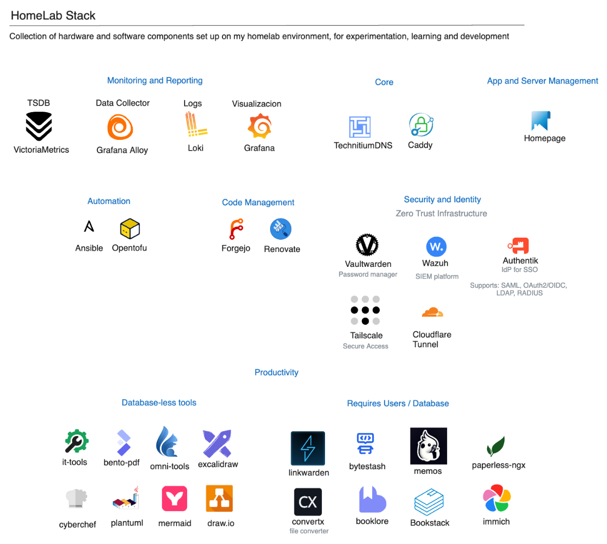

# HomeLab

## Hardware

| Device | RAM | Disks | OS | Arch | Purpose |
| ------ | --- | ----  | -- | ---- | --------|
| Beelink 8845HS | 64 GB  | 1TB SSD Nvme + 4TB SSD NVme           | Proxmox 9   | amd64 | Main server |  
| Raspberry Pi 5B | 4 GB | 500GB SD Nvme             | Raspberry Pi OS (bookworm) | arm64 | k8s/k3s server (dev)        |
| Raspberry Pi 5B Rev 1.0| 4 GB | 64GB microSD             | Raspberry Pi OS (bookworm) | arm64 | k8s/k3s server (dev)        |
| Raspberry Pi 3B |  1 GB   | 64GB microSD          | Raspberry Pi OS (bookworm) | arm64 | ??         |

## Other Equipment

| Device | CPU | RAM | Disks | OS | Arch | Purpose |
| ------ | --- | ----  | --- | ---- | ---| ------- |
| Chuwi Ubox | AMD Ryzen 6600H | 32 GB ddr5 | 500GB NVMe + 1TB SSD NVMe | Windows 11 | amd64 | Right now only windows. Future usage: Proxmox node |
| Mac Mini M2 | M2 | 16 GB | 256 GB | macOS | arm64 | AI Tools, ollama  |
| Machinist H61 LGA | i3-3220T | 16 GB ddr3 | 256 SSD NVMe + 3 x 1TB HDD |TrueNAS | x86-64 | NAS Server (demo) |

## Services running on Proxmox

{ width="500" loading="lazy" }